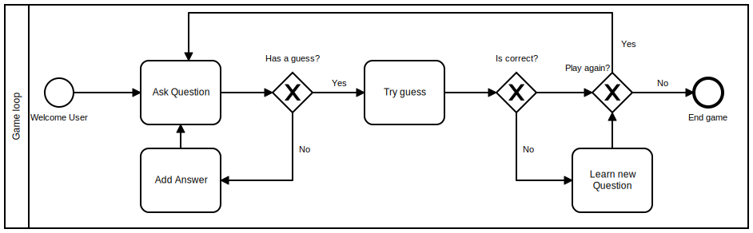

#### The problem
This application is a guessing food game! The user will be presented with a characteristic and should confirm or deny it, and based on the answers we should give the correct answer.

#### Basic Flow
The following image describes the steps to learn how to guess foods based on questions about then.



First Step , we give user a question. 
Based on the answer we will filter which foods are true for that question, and count the matches.
While there are more than 1 possible food we repeat this process until the remaining food counter hit :
- 1 -> try to guess. 
- 0 -> learn this scenario.

If the guess is correct, user can play again, otherwise it should teach the application how to win next time.

#### Example
Questions : 
```
["is pasta?", "is italian", "is japanese", "is round", "has tomatoes", "has noodles"]
```
Foods :
```
    Pizza [true, true, false, true, true]
    Yakisoba [true, false, true, false, false, true]
    Nhoque [true, true, false, false, true, false]
    Lasagna [true, true, false, false, true, false]
```

##### Implementation
We can represent this problem as a matrix of (questions, foods)
```    
              Pizza, Nhoque, Yakisoba, Lasagna
    pasta       T       T       T       T
    Italian     T       T       F       T
    Japanese    F       F       T       F
    Round       T       F       F       F
    tomatoes    T       F       F       T
    noodles     F       F       T       F
```

To improve the algorithm efficiency whe need to make questions where more foods will be discarded. 
Therefore, we can create a heuristic based on the absolute difference of True or False amount and optimize for 0.

Given a game state as the example, learning if the user wants pasta would give an heuristic value of 4, 
and in the next question after filtering we still have the same amount of foods, in other words no progress made. 
Meanwhile, the tomatoes questions would give a heuristic value of 0, and in this case it would split the possibilities to either 
[Pizza, Lasagna] or [Yakisoba, Nhoque] reducing the possibilities by half.

To leverage on the heuristic value will be using a [priority queue](https://docs.oracle.com/en/java/javase/11/docs/api/java.base/java/util/PriorityQueue.html),
to store questions and ordering by the heuristic value providing always the best question when polling an object.


