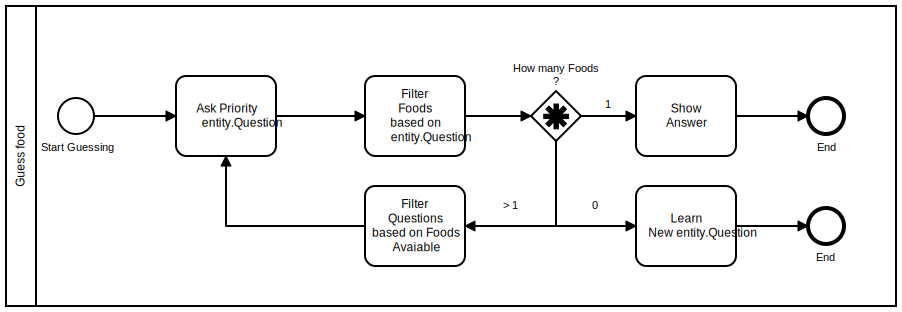

#### The problem
This application is a guessing food game! 
The user will be presented with a characteristic and should confirm or deny it, 
and based on the answers we should give the correct answer.

#### Basic Flow
The following image describes the steps to learn how to guess foods based on questions about then.



First Step , we give user a question. 
Based on the answer we will filter which foods are true for that question, and count the matches.
While there are more than 1 possible food we repeat this process until the remaining food counter hit :
- 1 -> try to guess. 
- 0 -> learn this scenario.

If the guess is correct, user can play again, otherwise it should teach the application how to win next time.

#### Example
Questions : 
```
["is pasta?", "is italian", "is japanese", "is round", "has tomatoes", "has noodles"]
```
Foods :
```
    Pizza [true, true, false, true, true]
    Yakisoba [true, false, true, false, false, true]
    Nhoque [true, true, false, false, true, false]
    Lasagna [true, true, false, false, true, false]
```

##### Implementation
We can represent this problem as a matrix of (questions, foods)
```    
              Pizza, Nhoque, Yakisoba, Lasagna
    pasta       T       T       T       T
    Italian     T       T       F       T
    Japanese    F       F       T       F
    Round       T       F       F       F
    tomatoes    T       F       F       T
    noodles     F       F       T       F
```

To improve the algorithm efficiency whe need to make questions where more foods will be discarded. 
Therefore, we can create a heuristic based on the absolute difference of True or False amount.

To leverage on the heuristic value will be using a [priority queue](https://docs.oracle.com/en/java/javase/11/docs/api/java.base/java/util/PriorityQueue.html),
to store questions and ordering by the heuristic value providing always the best question when polling a question. 
This way we always ask the most efficient question and end the game with lesser questions.

The side effect of this approach is that each game will have questions in different order,
and thus the matrix presented before will not be completed, since some foods will be found
with lesser questions. 
The following example represents a more accurate version of the used matrix.

```

Question list by id-name-weight : [0-pasta-1, 1-sweet-0, 2-deepFry,-2, 3-rounded-3, 4-cold-3]

  Chocolae Cake [ 0 - false,  1 - true,   2 - false,  3 - false,  4 - false]
  Lasagna       [ 0 - true,   1 - false,  2 - false,  3 - false,  4 - false]
  Coxinha       [ 0 - true,               2 - true,   3 - false,  4 - false]
  Pizza         [ 0 - true,               2 - false,  3 - true,   4 - false]
  IceCream      [ 0 - false,                          3 - false   4 - true ]
```
Assuming player will always answer no in the next round, the questions will show in the following order:
1. rounded? [Pizza] or [Chocolate Cake, Lasagna, Coxinha, IceCream]
2. cold? [Ice Cream] or [Chocolate Cake, Lasagna, Coxinha]
3. deepFry? [Coxinha] or [Chocolate Cake, Lasagna]
4. pasta? [Lasagna] or [Chocolate Cake]

Withot the heuristic, the oder would be the starting question order leading to a dead end since both answers can be wrong here.
1. pasta? [Lasagna, Coxinha, pizza] or [Chocolate Cake, IceCream]
2. sweet? [Chocolate Cake] or [Ice Cream]?

Furthermore we need also to acount for how many answers the questions has, since up to now we would get the same value for 
an answer with 1 true and 1 false, or 50 true and 50 false values. To account that we be changing our heuristic to be
    weight = the absolute difference of True or False amount * 1/10
    heuristic value  = answers amount / weight + 1 

This way smaller values for weight lead to higher heuristica value, and we avoid division by 0.